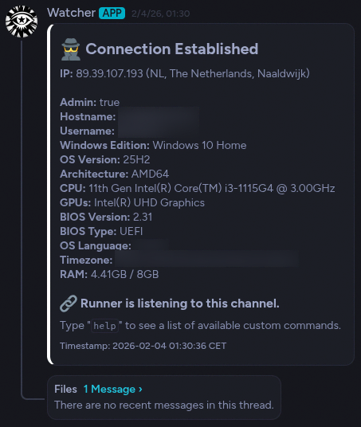
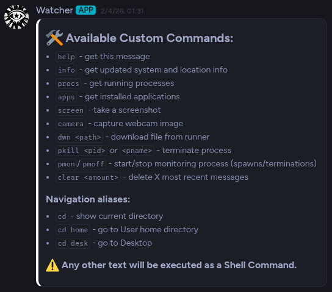
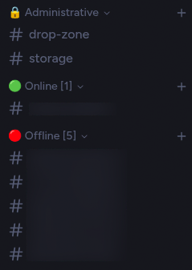

# NimDRAT

## Disclaimer

This project was created for **educational purposes only** — to learn Nim and to
study how Discord-based C2 tooling operates in a security-research context. Use it
exclusively on machines and networks you own or have explicit permission to test,
such as your own lab VM. Using it against systems without authorization is illegal.
The author assumes no liability for any misuse.

## Overview

A minimal Discord-based RAT written fully in Nim.

Two bots work together:

- **runner** — the endpoint agent. It collects system
  information, encrypts it, and sends to a private Discord server, and executes whatever the
  operator types in its session channel.
- **watcher** — the operator-side manager. It watches a *dropzone* channel, decrypts
  incoming encrypted payloads, creates a session channel per runner (victim's public IP as a name) and keeps
  channels sorted into Online / Offline categories via heartbeats.

## Screenshots

The watcher's first message upon victim launched the executable. In the thread you will find `running-processes.txt` and `installed-apps.txt`.



The list of available commands (type `help`):



Example channel and category structure of the server:



## Features

- **Encrypted channel** — every payload is zipped and AES-256 encrypted with a shared
  key; dropzone uploads carry random filenames, and command results travel back as
  encrypted packages with a `meta.json` manifest.
- **Automatic session management** — the watcher creates one channel per runner, reads
  heartbeats from channel topics and moves channels between Online / Offline
  categories with live counters.
- **System recon** — public IP & geo, private IP, MAC address, hostname, user,
  elevation, OS, CPU, GPUs, BIOS, RAM, locale and timezone, plus running-process and
  installed-application inventories.
- **Remote shell** — any message that is not a built-in command runs as a shell
  command (PowerShell on Windows, `sh` elsewhere) with working-directory tracking.
- **File & process control** — `dwn <path>` uploads files or zipped directories,
  `pkill` terminates processes, `pmon` / `pmoff` monitor process spawns and
  terminations.
- **Visual collection** — screenshots and webcam capture on Windows (the webcam uses
  a bundled [ESCAPI](https://github.com/jarikomppa/escapi) DLL extracted at runtime).
- **Standalone Windows binaries** — transport uses native WinHTTP/SChannel, so no
  OpenSSL DLLs are needed on the target; the runner builds as a GUI executable with
  icon/version resources (see `runner/materials`).

### The fake error on launch

On Windows builds, the runner opens with a realistic application error dialog —
*"installer.exe - Application Error: The application was unable to start correctly
(0xc000007b)"*. It is a plain Win32 `MessageBox`
fired on a background thread at startup (see `showFakeError` in `runner/main.nim`);
clicking OK dismisses it and nothing else changes — the bot is already connected
and keeps running silently in the background. Together with the GUI subsystem and
the icon/version resources in `runner/materials`, its purpose is cover: a launch
that visibly "fails" draws no attention, whereas a GUI process that starts with no
window at all would look far more suspicious.

## The `dimscord_nossl` fork

Both bots were built using
[dimscord_nossl](https://github.com/imitxtion/dimscord_nossl), my fork of
[dimscord](https://github.com/krisppurg/dimscord) — a
Discord library for Nim by [krisppurg](https://github.com/krisppurg). The fork adds
an option (`-d:windowsNativeTls`) to use Windows' native WinHTTP/SChannel transport
instead of OpenSSL, so the compiled bots have no `libssl` / `libcrypto` DLL
dependency and run on a plain Windows machine as standalone executables. Otherwise, on some
machinesOn
Linux/macOS it behaves exactly like upstream dimscord.

## Setup

Prerequisites: [Nim](https://nim-lang.org) >= 2.0 and a private Discord server you
control.

1. Create **two bot applications** in the
   [Discord developer portal](https://discord.com/developers/applications) — one
   watcher, one runner. Enable the **Message Content Intent** for both. Invite them to
   your server with permissions to manage channels, send messages, attach files and
   read message history.
2. In the server, create one text channel to act as the **dropzone** and two
   **categories** to act as the Online / Offline groups. Enable Developer Mode and
   copy the IDs of the guild, the dropzone, both categories and both bot users.
3. Clone this repo together with the library fork it builds against (both bots load
   it from the repository root):
   ```sh
   git clone https://github.com/imitxtion/nimdrat
   cd nimdrat
   git clone https://github.com/imitxtion/dimscord_nossl
   ```
4. Fill in `watcher/src/constants.nim` and `runner/src/constants.nim` — placeholder
   values are included. Use the **same guild, dropzone and `SharedKey`** on both
   sides, and give each runner deployment its own token.
5. Build and run:
   ```sh
   cd watcher  && nim c main.nim && ./main
   cd ../runner && nim c main.nim && ./bin/installer
   ```
   Start the watcher first, then the runner on the lab machine. The runner uploads an
   encrypted intel archive to the dropzone; the watcher decrypts it, creates the
   session channel and posts the summary. Type `help` in a session channel to list
   the commands — anything else is executed as a shell command.
